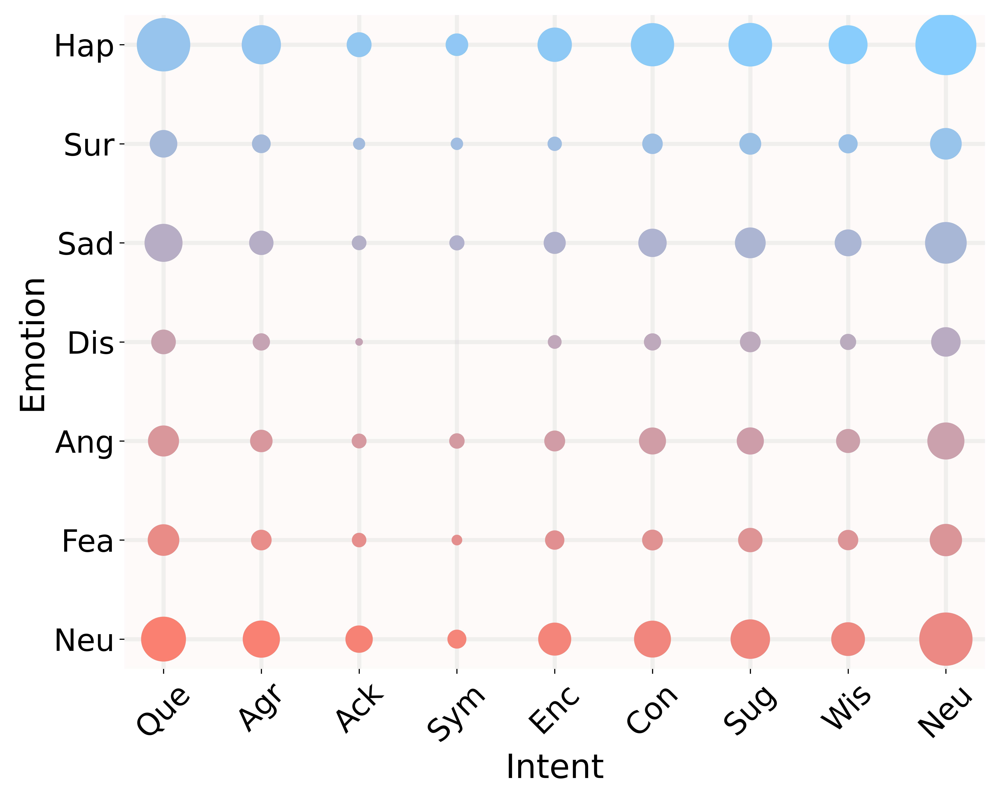
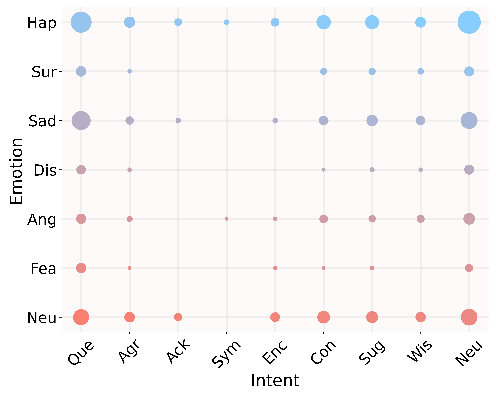

### Hi there 👋

<!--
**MC-EIU/MC-EIU** is a ✨ _special_ ✨ repository because its `README.md` (this file) appears on your GitHub profile.

Here are some ideas to get you started:

-->

The features are shared now:

Baidu Link:
(https://pan.baidu.com/s/1gxxr81tVytFTW2UjfTrh-g)

Please connect with the author by email to obtain the extraction code once the paper acceptance results are announced.

=====================   Analysis of MC-EIU Dataset   ==========================

  English Dataset
  Mandarin Dataset
  

We explore the correlation between emotion and intent of English and Mandarin datasets. 
Visualization of correlation between emotions and intents in the MC-EIU-English and MC-EIU-Mandarin Datasets. Each circle in the graph represents the sample count for a specific 'Emotion-Intent' pair. Larger circles indicate more samples and higher correlation.

