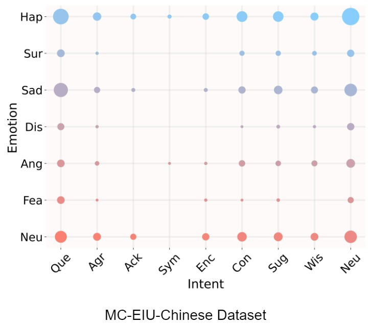

### Hi there 👋

<!--
**MC-EIU/MC-EIU** is a ✨ _special_ ✨ repository because its `README.md` (this file) appears on your GitHub profile.

Here are some ideas to get you started:

-->

# Features Download 
The features are shared now:

Baidu Yun Link:
(https://pan.baidu.com/s/1gxxr81tVytFTW2UjfTrh-g)

Please connect with the author by email to obtain the extraction code once the paper acceptance results are announced.

# Analysis of MC-EIU Dataset 

  
    

Figure 1: Visualization of correlation between emotions and intents in the MC-EIU dataset. Each circle in the graph represents the sample count for a specific "Emotion-Intent" pair. Larger circles indicate more samples and higher correlation.

We explore the correlation between emotion and intent in the MC-EIU-English and MC-EIU-Mandarin datasets.
We created two 7×9 two-dimensional matrixes, with each element representing the number of samples in the two datasets for each 'Emotion-Intent' pair. Using the sample count as the radius, we visualized circles at the corresponding matrix positions.

It can be observed that emotions and intents are not strictly one-to-one correspondences, and different intents vary in their influence on specific emotions, and vice versa. For example, compared to "Hap-Sym", "Hap-Agr" occurs at a higher frequency, indicating that "Agreeing" is more likely to drive the expression of "Happy".
Additionally, we observe that the correlation between emotion and intent in the English dataset is more intricate compared to the Mandarin dataset. For example, the emotion "Sur" is associated with all intent categories in the English dataset, whereas in the Mandarin dataset, it is only linked to 6 intent categories ("Que", "Agr", "Con", "Sug", "Wis", and "Neu"). As we are aware, such complex relationships can pose challenges for the model's learning process. Consequently, the performance of our model on the English dataset is relatively lower than that on the Mandarin dataset.

